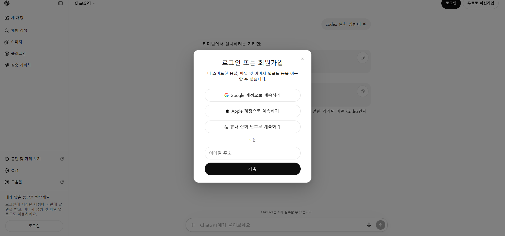
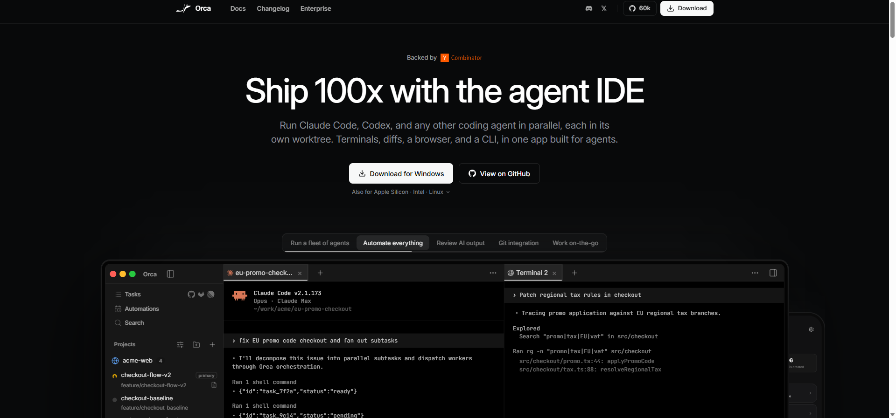
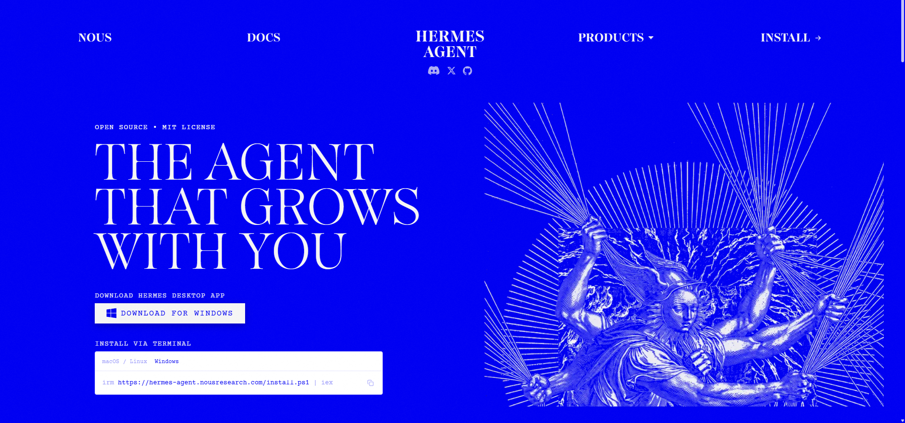
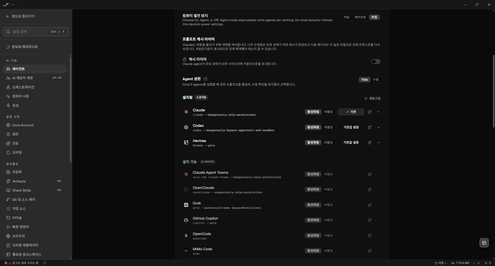
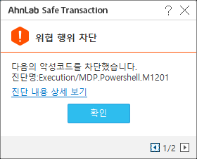

<div class="cover-markdown" markdown="1">

# Hermes 기반 데스크탑 업무 자동화 {.no_toc}

## Quick Start Guide {.no_toc}

**Windows · Orca · Codex · Hermes Agent · OpenAI Codex OAuth**<br>
문서 버전 1.4.1 · 2026-09-04 · 공개 배포용

> 사람은 목표와 승인 경계를 정하고, 에이전트는 PC에서 실행하고 검증하며 기록한다.

</div>

---

## 이 문서로 할 수 있는 것

이 문서는 처음 접하는 사용자가 Windows PC 한 대에 업무 자동화 환경을 만들고, ChatGPT/Codex 구독으로 Hermes를 인증한 뒤, Orca 안에서 Hermes를 실행하기까지의 전 과정을 안내한다. 실제 설치 세션에서 발생한 오류와 복구 절차도 함께 담았다.

완료 시 다음 상태가 된다.

- `C:\Automation`이 Orca 프로젝트 작업 공간으로 등록된다.
- Codex CLI와 Hermes Agent가 Windows 사용자 영역에 설치된다.
- Hermes가 OpenAI Codex OAuth를 통해 ChatGPT/Codex 구독을 사용한다.
- Codex는 `gpt-5.6-sol`, reasoning `low`, 1M context/900K auto compact로 설정된다.
- Hermes는 `gpt-5.6-sol-900k`, reasoning `low`로 설정된다.
- Orca에서 Hermes 탭을 열어 자연어로 데스크탑 업무를 요청할 수 있다.

### 5분 요약

1. ChatGPT에 조직 계정으로 로그인한다.
2. Orca를 설치하고 `C:\Automation`을 프로젝트로 추가한다.
3. Orca 터미널의 **PowerShell**에서 Codex를 설치하고 로그인한다.
4. Codex에게 Hermes 설치를 요청한다.
5. `hermes model`에서 **OpenAI → ChatGPT or Codex Subscription**을 선택해 별도 OAuth 인증을 한다.
6. 모델·reasoning·context 설정을 적용한다.
7. Orca 설정에서 Hermes를 감지한 후 Hermes 탭을 연다.
8. Obsidian과 `Hermes-Wiki` vault를 설치·연결하고, Hermes가 관련 질의와 주요 기록에서 Wiki를 사용하도록 설정한다.

> **중요:** 인증번호, OAuth device code, 비밀번호, API key는 캡처·문서·채팅에 남기지 않는다. 이 문서에도 실제 인증번호는 포함하지 않았다.

---

# 1. 왜 Hermes 기반 데스크탑 업무 자동화인가?

## 1.1 모델과 하네스는 다르다

GPT, Gemini, Claude(Opus 계열 포함) 같은 **LLM 모델**은 추론 엔진이다. 모델이 파일을 읽고, 명령을 실행하고, 브라우저를 조작하고, 결과를 검증하도록 연결하는 실행 소프트웨어를 이 문서에서는 **에이전트 하네스(agent harness)**라고 부른다.

| 구분 | 대표 예시 | 주된 사용 방식 |
|---|---|---|
| 웹 대화형 하네스 | ChatGPT Web, Gemini Web, Claude Web | 질문·답변, 파일 업로드, 조사와 초안 작성 |
| 개발/로컬 하네스 | Codex, Claude Code, Antigravity | 로컬 파일, 터미널, 코드베이스 중심 작업 |
| 범용 자동화 하네스 | Hermes Agent | 로컬 도구, 브라우저, 메시징, 스킬과 지속적 업무 자동화 |
| 에이전트 작업 환경 | Orca | 여러 CLI 에이전트·터미널·프로젝트를 한 화면에서 운영 |

Orca는 여러 CLI 에이전트, 터미널, 브라우저와 프로젝트를 한 앱에서 다루는 작업 환경이다. Hermes는 그 안에서 실제 업무를 수행하는 하네스다. 모델은 Hermes의 사고 엔진이고, Hermes는 도구를 쓰는 손과 실행 루프이며, Orca는 이를 관찰하고 운영하는 조종석에 가깝다.

<div class="flow-diagram">
  <div><strong>사용자</strong><span>목표 · 승인 · 검수</span></div>
  <b>→</b>
  <div><strong>Orca</strong><span>프로젝트 · 탭 · 관찰</span></div>
  <b>→</b>
  <div><strong>Hermes</strong><span>계획 · 도구 · 반복 실행</span></div>
  <b>→</b>
  <div><strong>LLM</strong><span>GPT · Claude · Gemini 등</span></div>
</div>

## 1.2 Hermes를 선택하는 이유

Hermes는 오픈 소스 에이전트로, 특정 모델 하나에 고정되지 않고 여러 모델 제공자와 API/OAuth 방식을 연결할 수 있다. 코드 작성뿐 아니라 파일 정리, 데이터 변환, 브라우저 작업, 반복 실행, 메시징과 스킬 기반 업무를 하나의 에이전트 흐름으로 구성하는 데 초점이 있다.

이 가이드에서는 다음 이유로 OpenAI Codex 구독 경로를 기본값으로 쓴다.

- 별도 API key를 문서나 `.env`에 복사하지 않고 OAuth로 로그인할 수 있다.
- Codex CLI와 Hermes에서 동일한 GPT 계열 모델을 사용할 수 있다.
- `gpt-5.6-sol` 계열과 낮은 reasoning 설정으로 속도와 업무 품질을 조정할 수 있다.
- 장시간 작업에는 큰 컨텍스트와 자동 압축 설정을 명시할 수 있다.

Hermes 공식 문서는 Windows 10/11 네이티브 설치와 OpenAI Codex의 ChatGPT OAuth 연결을 안내한다. 단, 구독 등급별 사용량 차감 방식은 공급자 정책에 따라 바뀔 수 있으므로 조직의 현재 플랜과 사용량 화면을 함께 확인한다.

## 1.3 데스크탑 자동화와 클라우드 자동화의 역할

개인 PC는 업무를 처음 관찰하고 자동화 방법을 검증하기에 좋다. 로그인된 브라우저, 실제 파일, 사내 프로그램과 사람이 같은 화면을 보며 빠르게 반복할 수 있기 때문이다. 반면 개인 PC 자동화는 절전, 사용자 입력, 팝업, 여러 에이전트의 충돌, 네트워크 변경에 영향을 받는다.

따라서 목표는 다음 3단계다.

1. **개인 PC에서 관찰:** 사람이 하던 절차, 예외, 승인 기준을 기록한다.
2. **단위 자동화로 검증:** 입력·출력·오류 처리·재실행 안전성을 확인한다.
3. **클라우드로 이식:** 검증된 작업을 격리된 계정과 환경에서 24×7 운영한다.

클라우드 전환 전에는 최소한 입력 스키마, 결과 검증 규칙, 비밀정보 관리, 실패 알림, 재시도 제한, 중복 실행 방지 조건이 문서화돼야 한다.

---

# 2. 설치 전 준비

## 2.1 요구사항

- Windows 10 또는 Windows 11
- 인터넷 연결
- 조직에서 사용할 ChatGPT/Codex 구독 계정
- 설치 승인 및 필요 시 UAC 승인 권한
- 최소 수 GB의 여유 디스크
- PowerShell 또는 Windows Terminal

> 명령 프롬프트의 `C:\...>`와 PowerShell의 `PS C:\...>`는 다르다. `irm`은 PowerShell의 `Invoke-RestMethod` 별칭이므로 **cmd.exe에서는 동작하지 않는다.**

## 2.2 계정과 보안 원칙

조직 계정은 각 조직의 승인된 계정을 사용한다. 인증번호는 계정 소유자가 직접 입력하고, 계정이나 인증 정책이 바뀌면 내부 운영 안내도 함께 갱신한다.

- 인증번호와 device code는 일회용이어도 문서에 남기지 않는다.
- API key나 OAuth 토큰 파일을 메신저로 공유하지 않는다.
- 패스워드를 AI 채팅에 붙여넣거나 `clipboard_read(include_text=true)`로 읽게 하지 않는다.
- Codex 인증 파일(`~/.codex/auth.json`)과 Hermes 인증 파일(`%LOCALAPPDATA%\hermes\auth.json`)은 서로 별도다.
- 보안 제품 경고가 뜨면 제품 전체를 끄거나 PowerShell 전체를 예외 처리하지 않는다.
- 에이전트에는 필요한 폴더와 기능만 허용하고, 결제·삭제·외부 전송은 사람이 승인한다.

---

# 3. ChatGPT 로그인

1. Chrome 또는 Edge에서 [https://chatgpt.com/](https://chatgpt.com/)을 연다.
2. **로그인**을 누르고 조직 계정을 입력한다.
3. 받은 편지함 인증이 필요하면 담당자에게 인증번호를 요청한다.
4. 인증번호는 화면에 직접 입력하고 캡처하지 않는다.

<figure>
  
  <figcaption><b>그림 1.</b> ChatGPT 로그인 시작 화면. 조직 정책에 맞는 로그인 수단을 선택한다.</figcaption>
</figure>

### 확인 기준

- ChatGPT 새 채팅 화면이 열린다.
- 우측 상단 계정 메뉴에서 올바른 조직 계정임을 확인한다.
- Codex 사용 권한이 포함된 구독인지 확인한다.

---

# 4. Orca 설치와 프로젝트 준비

## 4.1 Orca 설치

1. [https://www.onorca.dev/](https://www.onorca.dev/)를 연다.
2. **Download for Windows**를 선택한다.
3. 설치 프로그램을 실행한다.
4. Windows SmartScreen 또는 UAC가 나오면 파일 출처와 서명을 확인한 뒤 승인한다.

<figure>
  
  <figcaption><b>그림 2.</b> Orca 공식 사이트. Windows 다운로드 버튼에서 설치 파일을 받는다.</figcaption>
</figure>

## 4.2 자동화 전용 폴더 만들기

관리자 권한이 없는 조직 PC에서는 `C:\Automation` 생성이 막힐 수 있다. 이 경우 `%USERPROFILE%\Automation`을 사용해도 된다. 기본 가이드는 다음 경로를 쓴다.

```powershell
New-Item -ItemType Directory -Path C:\Automation -Force
```

폴더 권장 구조:

```text
C:\Automation\
├─ inbox\          # 사람이 넣는 원본 입력
├─ work\           # 에이전트 임시 작업
├─ output\         # 검수할 결과물
├─ logs\           # 실행 기록
└─ manuals\        # 절차서와 업무 규칙
```

원본은 `inbox`, 결과는 `output`으로 분리하면 에이전트가 입력을 덮어쓰는 사고를 줄일 수 있다.

## 4.3 Orca에 프로젝트 추가

1. Orca 왼쪽 **Projects** 영역의 `+`를 누른다.
2. `C:\Automation`을 선택한다.
3. 프로젝트 이름을 `Automation`으로 확인한다.
4. 프로젝트 안에서 새 터미널 탭을 연다.

---

# 5. Codex 설치와 기본 설정

## 5.1 Codex 설치

Orca 터미널이 **PowerShell**인지 확인한다. cmd라면 먼저 `powershell`을 입력하거나 새 PowerShell 탭을 연다.

```powershell
powershell -ExecutionPolicy Bypass -c "irm https://chatgpt.com/codex/install.ps1 | iex"
```

설치기가 기존 npm 기반 Codex를 발견하면 PATH 충돌을 피하기 위해 이전 설치 제거 여부를 물을 수 있다. 기존 세션을 모두 닫은 뒤 제거와 새 설치를 승인한다.

새 터미널을 열고 확인한다.

```powershell
codex --version
codex
```

이 설치 세션의 확인 결과는 `codex-cli 0.152.1`이었다. 버전은 업데이트에 따라 달라질 수 있다.

## 5.2 Codex 설정: Sol + low reasoning + 1M context

`~/.codex/config.toml`을 열고 첫 번째 섹션 헤더보다 위에 다음 값을 둔다.

```toml
model = "gpt-5.6-sol"
model_reasoning_effort = "low"
model_context_window = 1000000
model_auto_compact_token_limit = 900000
```

PowerShell에서 파일 위치를 여는 방법:

```powershell
notepad $HOME\.codex\config.toml
```

설정 의미:

| 키 | 값 | 의미 |
|---|---:|---|
| `model` | `gpt-5.6-sol` | 기본 모델 |
| `model_reasoning_effort` | `low` | 지연을 줄이면서 도구 작업에 필요한 추론 유지 |
| `model_context_window` | `1000000` | 클라이언트가 인식하는 최대 컨텍스트 크기 |
| `model_auto_compact_token_limit` | `900000` | 한도 전에 대화를 자동 압축할 기준 |

> 설정값은 모델이나 구독에 존재하지 않는 용량을 새로 만들어내지 않는다. 실제 사용 가능 컨텍스트와 사용량은 현재 모델·클라이언트·계정 정책의 제한을 따른다.

---

# 6. Hermes 설치

## 6.1 Codex에게 설치를 맡긴다

Codex가 실행된 뒤 다음처럼 요청한다.

```text
Windows 네이티브 환경에 Hermes Agent 공식 버전을 설치해 줘.
공식 설치 문서를 확인하고, 필요한 Python/Node/Git/uv 의존성을 설치해.
각 권한 요청은 이유를 설명하고, 설치 후 hermes --version과 PATH를 검증해.
Nous Portal 가입은 하지 않고 OpenAI Codex 구독 OAuth로 인증할 거야.
```

이 시점부터 사용자는 복잡한 명령을 직접 조합하기보다 목표와 승인 경계를 Codex에 설명하고, Codex가 실행 결과를 확인하도록 한다.

Hermes 공식 페이지의 Windows 설치 명령은 다음과 같다.

```powershell
iex (irm https://hermes-agent.nousresearch.com/install.ps1)
```

<figure>
  
  <figcaption><b>그림 3.</b> Hermes Agent 공식 사이트의 Windows 터미널 설치 명령.</figcaption>
</figure>

## 6.2 실제 설치에서 자동 처리된 항목

2026-09-03 설치 세션에서는 다음이 처리됐다.

| 항목 | 실제 처리 내용 |
|---|---|
| 설치 위치 | `%LOCALAPPDATA%\hermes` |
| uv | 관리형 `uv 0.12.9` 설치 |
| Python | `3.11.16` 설치 및 `venv` 생성 |
| Git | 기존 Git `2.53.0.windows.2` 감지 |
| 저장소 | SSH clone 실패 후 HTTPS로 자동 재시도 성공 |
| Node.js | 시스템 Node 24/npm 조건 불일치로 Hermes 관리형 Node 22.23.2 사용 |
| 보조 도구 | ripgrep, ffmpeg 설치/감지 |
| Python 패키지 | lockfile 동기화 실패 후 PyPI resolve로 `[all]` 설치 성공 |
| CUA driver | 데스크탑/브라우저 자동화를 위한 드라이버 설치 |
| PATH | `%LOCALAPPDATA%\hermes\bin`을 사용자 PATH에 추가 |
| Hermes | `v0.21.0`, Python `3.11.16`, OpenAI SDK `2.24.0` 확인 |

버전 번호는 당시의 기록이며 최신 설치에서는 달라질 수 있다. 설치 결과의 `[OK]`, `[!]`, 마지막 종료 코드를 함께 읽는다.

## 6.3 CUA Driver와 권한

CUA Driver는 화면·브라우저·윈도우 조작 같은 Computer Use 기능을 위한 구성요소다. 설치 중 자동 시작 예약 작업이나 UAC 승인이 요청될 수 있다.

> **관리자 권한 프로그램 자동화:** 대상 업무 프로그램이 관리자 권한으로 실행된 경우, 일반 권한의 Orca/Hermes는 Windows UIPI 보안 정책 때문에 해당 창을 클릭하거나 입력할 수 없다. 이때는 **Orca를 완전히 종료한 뒤 Orca 아이콘을 우클릭하여 `관리자 권한으로 실행`**해야 한다. 그러면 Orca에서 시작되는 Hermes와 CUA Driver도 같은 관리자 권한으로 실행되어 대상 프로그램을 조작할 수 있다. 대상 프로그램과 자동화 도구의 권한 수준을 맞추며, 권한 차단을 우회하는 별도 입력 도구는 사용하지 않는다.

- 실행 파일과 다운로드 출처를 확인한다.
- 관리자 권한 창을 자동화할 때는 Orca를 관리자 권한으로 다시 실행한다.
- 일반 업무는 승인 기반으로 시작한다.
- `--yolo` 또는 위험 승인 우회 옵션은 격리된 테스트에서만 사용한다.
- 결제, 메시지 발송, 삭제, 계정 변경은 항상 사람 확인 단계를 둔다.
- 텔레메트리를 원치 않으면 설치된 실행 파일에서 다음을 실행한다.

```powershell
& "$env:LOCALAPPDATA\Programs\Cua\cua-driver\bin\cua-driver.exe" telemetry disable
```

## 6.4 설치 확인

설치가 끝나면 기존 터미널을 완전히 닫고 새 PowerShell을 연다.

```powershell
Get-Command hermes
hermes --version
hermes doctor
```

정상 경로는 보통 다음과 같다.

```text
C:\Users\<사용자>\AppData\Local\hermes\bin\hermes.exe
```

---

# 7. ChatGPT/Codex 구독으로 Hermes 인증

Nous Portal 가입 화면이 나와도 이 가이드에서는 사용하지 않는다. 취소한 뒤 다음을 실행한다.

```powershell
hermes model
```

선택 순서:

1. **OpenAI ▸**
2. **ChatGPT or Codex Subscription**
3. 기존 Codex CLI 자격 증명 import 여부가 나오면 충돌 방지를 위해 **별도 로그인** 권장
4. 터미널에 표시된 `https://auth.openai.com/codex/device`를 연다.
5. 일회용 device code를 입력하고 승인한다.
6. 기본 모델에서 `gpt-5.6-sol-900k`를 선택한다.

Hermes는 Codex CLI와 별도의 OAuth 세션을 `%LOCALAPPDATA%\hermes\auth.json`에 저장한다. Codex CLI 로그인에 영향을 주지 않도록 별도 로그인을 권장한다.

## 7.1 Hermes 모델 설정 확인

`%LOCALAPPDATA%\hermes\config.yaml`의 핵심 값:

```yaml
model:
  default: gpt-5.6-sol-900k
  provider: openai-codex
  base_url: https://chatgpt.com/backend-api/codex

agent:
  reasoning_effort: low
```

Codex와 Hermes는 설정 파일이 다르다.

| 대상 | 설정 파일 | 이 가이드의 기본 모델 |
|---|---|---|
| Codex CLI | `%USERPROFILE%\.codex\config.toml` | `gpt-5.6-sol` + 1M context override |
| Hermes Agent | `%LOCALAPPDATA%\hermes\config.yaml` | `gpt-5.6-sol-900k` |

---

# 8. Orca에서 Hermes 감지 및 실행

1. Orca 좌측 하단 **설정**을 연다.
2. **AI 기능 → 에이전트**로 이동한다.
3. 설치됨 목록에서 **Hermes**가 활성화됐는지 확인한다.
4. 보이지 않으면 **새로고침**을 누른다.
5. 프로젝트로 돌아가 탭 추가 `+`를 누른다.
6. **Hermes**를 선택한다.
7. 터미널에 Hermes 시작 화면과 프롬프트가 나오면 준비 완료다.

<figure>
  
  <figcaption><b>그림 4.</b> Orca 설정의 설치됨 목록에 Hermes가 감지된 상태.</figcaption>
</figure>

### 첫 실행 체크

- 모델: `gpt-5.6-sol-900k`
- reasoning: `low`
- 현재 폴더: `C:\Automation` 또는 지정한 프로젝트 폴더
- 도구 목록: 파일·터미널·브라우저 관련 도구가 필요한 범위에서만 활성화
- 민감정보: 프롬프트나 로그에 비밀번호가 없는지 확인

---

# 9. 첫 업무를 안전하게 시키는 법

## 9.1 로그인 자동화: 패스워드는 AI가 읽지 않게 전달한다

### 브라우저 선택 및 설치 원칙

Hermes가 웹 업무를 시작할 때는 **업무 자동화 전용 Chrome 또는 Edge 프로필을 기본으로 사용한다.** 개인·관리자 프로필의 쿠키, 저장된 자격 증명, 확장 프로그램과 다른 조직 세션을 자동화에 불필요하게 노출하지 않기 위해서다.

1. 조직이 승인한 자동화 전용 브라우저 프로필과 대상 계정을 사용한다.
2. 기존 개인·업무 프로필은 사용자가 특정 창·프로필과 작업 범위를 명시적으로 승인한 경우에만 사용한다.
3. 승인된 기존 프로필을 사용할 때도 관련 없는 탭, 저장된 로그인, 확장 프로그램과 다른 조직 세션에는 접근하지 않는다.
4. 새 프로필이나 브라우저 설치가 필요하면 설치 출처, 저장 위치, 로그인 범위와 예상 변경사항을 설명하고 **사용자 승인을 받은 뒤에만** 진행한다.
5. 사용자가 설치·프로필 생성을 승인하지 않으면 승인된 대체 프로필을 확인하고, 없으면 중단 사유를 보고한다.

> **금지:** 자동화 편의를 이유로 개인 기본 프로필을 임의로 사용하거나, 별도 Chrome/Chromium·프로필·확장 프로그램을 조용히 설치 또는 생성하지 않는다. 브라우저 설치, 기본 브라우저 변경, 프로필 생성, 확장 프로그램 설치는 모두 사용자 확인 대상이다.

에이전트 요청 예시:

```text
웹 작업은 조직이 승인한 자동화 전용 Chrome 또는 Edge 프로필을 사용해.
개인·기본 프로필은 내가 특정 창과 작업 범위를 명시적으로 승인하지 않으면 사용하지 마.
승인된 프로필이 없으면 임의로 설치하거나 만들지 말고 제품·출처·저장 위치·로그인 범위를 설명한 뒤 내 승인을 받아.
```

패스워드는 채팅, 프롬프트, 명령행, 로그, 스크린샷, 작업 파일에 평문으로 남기지 않는다. **클립보드도 암호화된 비밀 저장소가 아니라 잠시 평문을 들고 있는 공간**이므로 짧게 사용하고 바로 비운다.

### 권장 순서 A — 브라우저/Windows 자동완성

가장 안전한 기본 방식이다.

1. 브라우저 비밀번호 관리자, Windows Credential Manager, 1Password 등 승인된 저장소에 자격 증명을 보관한다.
2. 에이전트에게 로그인 페이지 이동과 계정 입력칸 포커스까지만 요청한다.
3. 자동완성 UI가 뜨면 사용자가 직접 계정을 선택하거나 생체인증·PIN을 승인한다.
4. 에이전트는 로그인 성공 화면만 확인하고 업무를 계속한다.

에이전트 요청 예시:

```text
로그인 페이지로 이동하고 이메일 입력칸까지 준비해 줘.
비밀번호와 클립보드 평문은 읽거나 출력하지 마.
비밀번호 입력 단계가 되면 멈추고 내가 Windows/브라우저 자동완성을 승인하도록 알려 줘.
로그인이 끝났다고 내가 말하면 성공 여부만 확인하고 계속해.
```

### 권장 순서 B — 일회성 클립보드 수동 붙여넣기

자동완성을 쓸 수 없는 레거시 사이트에서만 사용한다. 핵심은 **에이전트가 클립보드 값을 읽는 것이 아니라, 사용자가 포커스된 비밀번호 칸에 직접 붙여넣는 것**이다.

1. 비밀번호 관리자에서 **복사**를 누른다. 메모장이나 채팅창을 경유하지 않는다.
2. 에이전트에게 로그인 페이지를 열고 비밀번호 칸에 포커스를 둔 뒤 멈추게 한다.
3. 화면 공유·녹화·스크린샷이 켜져 있지 않은지 확인한다.
4. 사용자가 직접 `Ctrl+V`를 누른다. 에이전트에게 비밀번호 값을 말하거나 보내지 않는다.
5. 로그인 버튼은 사용자가 직접 누르거나, 붙여넣기가 끝났다고 알린 뒤 에이전트가 누르게 한다.
6. 즉시 클립보드를 비우고 Windows 클립보드 기록도 지운다.

클립보드 비우기:

```powershell
Set-Clipboard -Value ''
```

Windows 클립보드 기록을 사용하는 PC에서는 `Win+V`를 누르고 **모두 지우기**를 선택한다. 여러 기기 간 클립보드 동기화가 켜져 있다면 조직 보안 정책에 따라 끈다.

에이전트 요청 예시:

```text
로그인 화면에서 아이디를 입력하고 비밀번호 칸을 클릭한 뒤 멈춰.
clipboard_read를 호출하거나 클립보드 내용을 출력·요약·로그 저장하지 마.
내가 직접 Ctrl+V로 붙여넣고 "완료"라고 할 때까지 기다려.
완료 후 로그인 버튼을 누르고 성공 여부만 확인해.
그 다음 Set-Clipboard -Value ''로 클립보드를 비워.
```

### 금지 패턴

- 채팅에 `비밀번호는 ...`라고 입력
- PowerShell 명령행 인수에 비밀번호 포함
- 에이전트에게 클립보드 평문을 읽고 다시 말해 달라고 요청
- 패스워드 입력 화면 캡처 또는 화면 녹화
- 클립보드 기록에 비밀번호를 고정
- 관리자 권한 창에 일반 권한 에이전트가 입력을 주입하도록 우회

### 반복 로그인 자동화

매번 사람이 붙여넣어야 하는 업무는 클립보드 자동화가 아니라 **비밀 저장소 연동** 대상으로 본다. Hermes는 1Password와 Bitwarden Secrets Manager를 지원한다. 브라우저 계정은 승인된 브라우저 프로필/비밀번호 관리자의 자동완성을 사용하고, API key·token은 Hermes secret source에서 런타임에 주입한다.

```powershell
hermes secrets bitwarden setup
```

비밀 저장소를 구성해도 결제, 권한 변경, 외부 전송 등 고위험 작업은 사람 승인 단계를 유지한다.

좋은 요청에는 목표, 입력, 출력, 금지사항, 검증 방법이 있다.

```text
목표: inbox 폴더의 엑셀 파일을 읽어 거래처별 합계를 만든다.
입력: C:\Automation\inbox\*.xlsx
출력: C:\Automation\output\거래처별_합계.xlsx
제약: 원본 파일을 수정하거나 삭제하지 않는다. 외부 전송은 하지 않는다.
검증: 원본 총합과 결과 총합이 일치하는지 비교하고, 불일치 행을 별도 시트에 기록한다.
완료 보고: 생성 파일 경로, 처리 건수, 검증 결과, 사람이 확인할 예외를 요약한다.
```

## 9.2 권장 작업 패턴

1. 먼저 읽기 전용으로 현황을 조사시킨다.
2. 실행 계획과 변경 대상 파일 목록을 받는다.
3. 위험도가 낮은 로컬 변경부터 승인한다.
4. 결과를 샘플 검증한다.
5. 반복 가능하면 스크립트·스킬·매뉴얼로 고정한다.
6. 운영 지표와 실패 알림을 추가한 뒤 클라우드 이식을 검토한다.

## 9.3 ChatGPT에 이 문서를 올린 뒤 시작하는 프롬프트

이 PDF 또는 HTML/Markdown을 ChatGPT에 첨부하고 다음을 입력한다.

```text
첨부한 「Hermes 기반 데스크탑 업무 자동화 Quick Start Guide」를 운영 기준으로 사용해 줘.
나는 Windows와 자동화에 익숙하지 않을 수 있으니 한 번에 한 단계씩 안내해.
각 단계에서 내가 봐야 할 화면, 실행할 명령, 성공 기준을 알려 줘.
비밀번호·인증번호·OAuth device code·API key는 채팅에 입력하라고 하지 마.
로그인 시 비밀번호를 clipboard_read로 읽지 말고, 로그인 화면과 비밀번호 입력칸까지만 준비한 뒤 내가 OS 자동완성 또는 Ctrl+V를 직접 수행하도록 멈춰.
내가 입력 완료를 알리면 클립보드를 비우고 로그인 성공 여부만 확인해.
설치 오류가 나면 문서의 실제 설치 세션과 트러블슈팅 표를 우선 참고해 원인을 진단해.
삭제, 결제, 외부 전송, 보안 예외 추가 전에는 반드시 내 승인을 받아.
먼저 현재 PC에서 ChatGPT 로그인, Orca, Codex, Hermes 중 어디까지 완료됐는지 질문해 줘.
```

## 9.4 첫 실무 시나리오: 고객 포털 → ERP → 알림

첫 자동화는 한 번에 전부 맡기지 말고 세 구간으로 나눠 검증한다.

1. 고객 포털에서 신규 주문 목록을 **읽기 전용**으로 확인한다.
2. 확인한 주문을 ERP 입력 화면에 옮기되, 최초 실행은 제출 직전까지 진행하고 사람이 값과 건수를 대조한다.
3. 성공·보류·실패 건수를 조직의 승인된 메시징 도구에서 미리보기한 뒤 승인받아 전송한다.

로그인 계정의 아이디는 업무 프롬프트에 넣을 수 있지만, 비밀번호는 브라우저 비밀번호 관리자나 조직이 승인한 자격 증명 저장소에 보관한다. 반복 사용한다는 이유로 `.txt`, `.env`, Markdown, Hermes 메모리 또는 대화 로그에 저장하지 않는다. 에이전트는 로그인 화면과 입력칸까지만 준비하고, 사용자가 자동완성 또는 직접 붙여넣기를 완료하면 성공 여부만 확인한다.

첫 실행 프롬프트 예시:

```text
목표: 고객 포털의 신규 주문을 확인하고 ERP 입력 및 결과 알림을 준비해.
고객 포털: https://portal.example.com/login
로그인 아이디: user@example.com

1) 포털을 열고 아이디를 입력한 뒤 비밀번호 칸에 포커스를 두고 멈춰.
2) 비밀번호·클립보드 평문을 읽거나 출력·저장하지 마. 내가 자동완성 또는 Ctrl+V를 완료했다고 말하면 계속해.
3) 신규 주문을 읽기 전용으로 수집하고 주문번호·고객·수량을 표로 먼저 보여 줘.
4) 내가 승인하면 ERP에 입력하되 첫 실행은 최종 제출 직전에 멈춰.
5) 제출 결과를 다시 조회해 성공·보류·실패 건수를 대조해.
6) 알림 문안을 미리 보여 주고, 내 승인 뒤 지정 채널로 한 번만 전송해.
7) 실패한 항목은 재시도하지 말고 원인과 수동 처리 방법을 보고해.
```

> 주문 제출과 메시지 발송은 외부 상태를 바꾸는 작업이다. 주문번호를 실행 키로 저장해 같은 주문이 두 번 입력되지 않게 하고, 메시지에도 비밀번호·세션 쿠키·토큰·고객 민감정보를 넣지 않는다.

## 9.5 Obsidian 기반 업무 Wiki와 Hermes 연동

### 설치 결과와 기본 위치

Windows용 Obsidian을 설치하고 다음 폴더를 기본 vault로 등록한다.

```text
%USERPROFILE%\Documents\Hermes-Wiki
```

다른 사용자 계정에 설치할 때는 `%USERPROFILE%\Documents\Hermes-Wiki`를 사용한다. Hermes 설정에는 비밀정보가 아닌 동작 설정으로 Wiki 경로를 저장한다. `WIKI_PATH`나 `OBSIDIAN_VAULT_PATH` 같은 경로를 `.env`에 넣는 방식은 사용하지 않는다.

### 사람이 일하는 방식 중심의 구조

기본 raw/entity/concept 구조에 결정·반복 절차·진행 맥락·검토 후보를 분리했다. 앱 기능보다 사람이 보는 신호, 판단 기준, 승인 경계, 예외, 검증, 인수인계를 먼저 기록한다.

```text
Hermes-Wiki\
├─ SCHEMA.md                 # 도메인, 태그, 문서 기준, 자동 반영 정책
├─ index.md                  # 정식 페이지 카탈로그
├─ log.md                    # append-only 변경 기록
├─ raw\                      # 변경하지 않는 원문과 증거
│  ├─ articles\
│  ├─ papers\
│  ├─ transcripts\
│  └─ assets\               # Obsidian 첨부 기본 위치
├─ entities\                # 사람·조직·제품·시스템
├─ concepts\                # 원리와 개념
├─ decisions\               # 상황·결정·이유·대안·재검토 조건
├─ playbooks\               # 반복 절차·승인·예외·검증·롤백
├─ projects\                # 목표·상태·다음 행동·위험
├─ comparisons\
├─ queries\
├─ inbox\candidates\        # 불확실한 자동 수집 후보
└─ _meta\                    # 검토 임계치와 자동화 상태
```

초기 의견 수렴 항목은 `queries/wiki-structure-review.md`에 둔다. 후보가 쌓였을 때 업무별 폴더 추가 여부, owner/review 날짜의 필수화, 승인 template, 후보 검토 빈도, 프로젝트 회고 의무화를 함께 검토한다.

### 즉시 기록과 누적 후보 정책

세션이 끝날 때까지 기다리지 않는다.

- 사용자가 명확히 정한 결정, 실제 적용된 설정, 도구 결과로 검증된 반복 절차는 **같은 턴에** 정식 Wiki에 반영한다.
- 정식 반영 시 페이지 frontmatter, 최소 2개 wikilink, `index.md`, `log.md`를 함께 갱신한다.
- 추정·제안·미검증 주장·사용자 판단이 필요한 내용은 `inbox/candidates/`에 후보로 남긴다.
- 후보 검토는 매 세션 묻지 않는다. 기본값은 **후보 5건 이상**이며 **마지막 안내 후 7일 이상** 지난 경우다.
- 후보를 정식 지식으로 취급하지 않는다. 검토 후 병합·보류·폐기한다.
- 비밀번호, API key, OAuth/device code, 인증 토큰, 세션 쿠키는 정식 페이지와 후보 어디에도 저장하지 않는다.

### `wiki-companion` Hermes plugin

사용자 plugin은 다음 위치에 설치한다.

```text
%LOCALAPPDATA%\hermes\plugins\wiki-companion\
├─ plugin.yaml
└─ __init__.py
```

plugin 버전은 `1.0.0`이다. 기능은 다음과 같다.

1. 새 세션의 고정 system-prompt section에 Wiki 운영 정책을 넣는다.
2. 매 턴 `pre_llm_call`에서 사용자 질의와 관련된 정식 페이지를 최대 3개까지 찾아 제한된 길이로 주입한다.
3. agent가 해당 턴에 정식 Wiki를 갱신했다면 추가 후보를 만들지 않는다.
4. 결정·설정·검증·절차 성격의 턴인데 `log.md`가 갱신되지 않았다면 민감 패턴을 제거한 immutable 후보 파일을 만든다.
5. 후보 수와 유예기간을 모두 만족할 때만 검토 제안을 한 번 주입한다.

설정과 활성화:

```powershell
hermes config set --force plugins.entries.wiki-companion.settings.wiki_path "C:/Users/<사용자>/Documents/Hermes-Wiki"
hermes config set --force plugins.entries.wiki-companion.settings.review_threshold 5
hermes config set --force plugins.entries.wiki-companion.settings.review_cooldown_days 7
hermes plugins enable --no-allow-tool-override wiki-companion
```

검증:

```powershell
hermes plugins doctor "$env:LOCALAPPDATA\hermes\plugins\wiki-companion" --ci
hermes config get plugins.entries.wiki-companion
hermes plugins show wiki-companion
```

`plugins.enabled`에 `wiki-companion`이 표시되고 Doctor가 `0 tool(s), 2 hook(s)`와 성공을 보고해야 한다. plugin은 내장 도구를 override하지 않는다.

> system prompt와 plugin 등록은 세션 시작 시 고정된다. 설치 직후 현재 대화에는 소급 적용되지 않으므로 **Hermes 또는 Orca의 Hermes 탭을 다시 시작하고 새 세션을 연다.**

### Obsidian 확인

Obsidian 왼쪽 아래 vault 이름이 `Hermes-Wiki`이고 파일 탐색기에 `_meta`, `concepts`, `entities`, `queries`, `index`, `log`, `SCHEMA`가 보이면 기본 연결이 완료된 것이다. `.obsidian/app.json`은 새 노트를 `inbox`에 만들고 첨부 파일을 `raw/assets`에 저장하도록 구성한다.

---

# 10. 트러블슈팅

## 10.1 `'irm' is not recognized` 또는 `'hermes' is not recognized`

### 증상

```text
'irm' is not recognized as an internal or external command
'hermes' is not recognized as an internal or external command
```

### 원인과 해결

- `irm` 오류: 명령을 cmd.exe에서 실행했다. PowerShell을 열고 다시 실행한다.
- `hermes` 오류: 설치가 시작되지 않았거나 기존 터미널이 새 PATH를 읽지 못했다.
- 새 PowerShell을 연 뒤 `Get-Command hermes`를 실행한다.
- 직접 경로로 확인한다.

```powershell
& "$env:LOCALAPPDATA\hermes\bin\hermes.exe" --version
```

## 10.2 Python 3.11 설치 단계에서 종료

실제 세션에서는 Hermes 관리형 `uv` 설치 후 Python 단계에서 오류 메시지 없이 종료 코드 1이 발생했다. 다음으로 Python을 먼저 설치한 뒤 공식 설치기를 재실행해 복구했다.

```powershell
& "$env:LOCALAPPDATA\hermes\bin\uv.exe" python install 3.11
```

재실행 시 기존 저장소가 감지된다. 최초 실패 과정에서 생긴 변경을 stash할 수 있으며, 사용자 커스터마이징이 전혀 없는 신규 설치라면 복원하지 않고 계속 진행해도 된다. 기존 사용자가 수정한 파일이 있다면 먼저 stash 내용을 확인한다.

## 10.3 Git SSH clone 실패

```text
git@github.com: Permission denied (publickey)
```

Hermes 설치기는 HTTPS clone으로 재시도할 수 있다. 이어서 `Repository ready`가 표시되면 정상이다. HTTPS도 실패하면 프록시, 방화벽, GitHub 접근 정책을 확인한다.

## 10.4 Node/npm 버전 불일치

시스템 Node가 있어도 npm 버전 조건이 맞지 않을 수 있다. 실제 세션에서는 시스템 Node 24 대신 Hermes 관리형 Node 22를 사용자 영역에 설치했다. 최신 설치기는 다른 LTS 버전을 선택할 수 있으므로 설치기의 관리형 버전을 우선 사용한다.

## 10.5 lockfile 또는 npm 선택 구성요소 경고

- `uv.lock ... --locked`: 설치기가 PyPI resolve 단계로 fallback하고 주 패키지 import 검증이 성공했는지 본다.
- Browser/TUI npm 경고: 핵심 CLI와 별개일 수 있다. `hermes doctor`로 실제 누락 기능을 확인한다.
- Computer Use runtime 경고: 일반 채팅은 가능하지만 데스크탑 조작 전에 `hermes computer-use install` 또는 `hermes doctor` 안내를 따른다.

## 10.6 AhnLab Safe Transaction 위험 행위 차단

<div class="warning-grid">
<figure>
  
  <figcaption><b>그림 5.</b> 원격 스크립트 실행 또는 숨김 PowerShell 자동 실행이 행위 기반 탐지에 걸릴 수 있다.</figcaption>
</figure>
<div>

`Execute/MDP.Powershell.M1201` 같은 경고는 PowerShell이 원격 콘텐츠를 받아 즉시 실행하는 패턴이나 숨김 PowerShell 자동 실행을 탐지했을 때 나타날 수 있다. 이것만으로 안전 또는 악성을 단정하지 말고 출처, 실행 명령, 실제 파일을 확인한다.

1. 보안 제품 전체를 종료하지 않는다.
2. PowerShell 전체나 사용자 폴더 전체를 예외 처리하지 않는다.
3. 공식 URL인지 확인하고 Codex에게 스크립트를 파일로 받아 검토하도록 요청한다.
4. 설치 후 자동 실행 작업이 PowerShell을 중계하면 실제 실행 파일 직접 호출로 바꾼다.
5. 조직 보안 정책상 차단이 유지되면 보안 담당자에게 해시·URL·탐지명을 전달한다.

</div>
</div>

예약 작업 확인:

```powershell
Get-ScheduledTask -TaskName 'cua-driver-serve' |
  ForEach-Object { $_.Actions | Select-Object Execute, Arguments, WorkingDirectory }
```

이 설치 세션에서는 관리자 PowerShell로 실행 대상을 다음과 같이 직접 실행하도록 변경했다.

```text
Execute:   %LOCALAPPDATA%\Programs\Cua\cua-driver\bin\cua-driver.exe
Arguments: serve
```

이렇게 하면 기능을 유지하면서 로그인 때 숨김 PowerShell을 한 번 더 거치는 구조를 제거할 수 있다. 작업 변경에는 관리자 권한이 필요하다.

## 10.7 로컬 Hermes에 `holmes/live-main` 패치 적용하기

### 증상과 적용 원칙

고객 포털을 열도록 요청했는데 원격 디버깅 승인 안내만 반복하거나, 실제 Chrome 창 타깃·Slack 첨부 전달이 기대대로 동작하지 않을 수 있다. 이 환경에서는 [holmesLee-ws/hermes-agent](https://github.com/holmesLee-ws/hermes-agent)의 [`holmes/live-main`](https://github.com/holmesLee-ws/hermes-agent/tree/holmes/live-main)을 로컬 Git 설치본에 적용한다. 누락됐던 런타임 스키마와 회귀 테스트는 [PR #1](https://github.com/holmesLee-ws/hermes-agent/pull/1)로 병합됐다.

> **검증·고정 커밋:** `b244576e48206f3ade97cac5d0b8125033970c66` — 스크립트는 이 SHA가 원격 브랜치 이력에 포함된 경우에도 브랜치의 최신 HEAD가 아니라 이 고정 커밋만 적용한다.

#### 2026-09-03 재점검에서 확인된 부분 적용 원인

`c404ffe9e`까지만 적용하면 Computer Use 스킬 원본과 웹 문서의 문구는 바뀌지만 실제 세션에 영향을 주는 모든 계층이 함께 바뀌지 않았다. 누락 지점은 다음 네 곳이다.

| 계층 | 경로 | 필요한 조치 |
|---|---|---|
| 실제 도구 스키마 | `tools/computer_use/schema.py` | 명시적 로그인 요청에 한해 자격 증명 입력을 허용하되 값의 노출·저장 금지와 결제 재확인 유지 |
| 회귀 테스트 | `tests/tools/test_computer_use.py` | 예전 전면 금지 문구가 아니라 새 제한 정책을 검사 |
| 저장소 스킬 원본 | `skills/autonomous-ai-agents/computer-use/SKILL.md` | 새 세션에 주입할 자격 증명 입력 경계 명시 |
| 현재 프로필의 설치 사본 | `%LOCALAPPDATA%\hermes\skills\autonomous-ai-agents\computer-use\SKILL.md` | 저장소와 별도로 존재하므로 직접 동기화 |

PR 병합으로 앞의 세 저장소 계층은 포크 자체에 반영됐다. 다만 현재 프로필의 설치 사본은 저장소 밖에 있고 사용자 수정본일 수 있어 별도 동기화가 필요하다. 최신 스크립트는 다른 사용자 지침은 보존하면서 구형 금지 블록을 제거하고 새 정책을 삽입하며, 변경 전 사본을 별도 백업한다. 비밀번호 값을 읽거나 출력하거나 파일·메모리에 보존하는 기능은 허용하지 않는다. 결제·구매·송금·계정 복구는 별도 명시적 확인 대상이다.

패치는 실행 중인 Hermes가 자기 소스를 읽는 동안 적용하지 않는다. Python 모듈이 구버전과 신버전으로 섞일 수 있으므로 **Hermes와 Orca의 Hermes 탭을 완전히 종료한 뒤 Windows CMD에서 실행**한다. `bash`는 사용하지 않는다. Windows의 `bash.exe`가 WSL 실행기로 연결되어 있으면 “설치된 배포가 없습니다”라는 오류가 난다.

<div class="callout warning">
<strong>주의.</strong> 이 방식은 현재 소스에서 <code>local/holmes-live-main</code> 전용 브랜치로 이동한다. 기존 HEAD는 날짜가 붙은 백업 브랜치에 보존한다. 커밋하지 않은 파일이 하나라도 있으면 중단하며, 이를 강제로 폐기하는 옵션은 제공하지 않는다.
</div>

### 제공 파일

이 가이드 폴더의 `scripts` 디렉터리에 두 파일을 함께 보관한다.

| 파일 | 역할 |
|---|---|
| `scripts/apply-holmes-patch.py` | 사전 검사, SHA 고정, URL 직접 fetch, 소스·프로필 백업, 패치 적용, 검증과 실패 시 소스·의존성 롤백 |
| `scripts/apply-holmes-patch.cmd` | Hermes 가상환경 Python을 우선 사용하고 종료 코드를 전달하는 CMD 실행 래퍼 |

### Python 패치 도구를 만드는 설계

단순히 `git reset` 명령만 저장하지 않고 다음 안전장치를 한 프로그램에 넣는다.

1. `%LOCALAPPDATA%\hermes\hermes-agent`와 활성 Hermes 홈을 계산한다.
2. `git`, `.git`, Hermes 전용 Python·실행 파일을 확인하고 PATH 또는 Hermes 관리형 경로에서 `uv.exe`를 찾는다.
3. `git status --porcelain` 결과가 있으면 중단한다. 로컬 파일을 강제로 버리지 않는다.
4. 정확한 refspec으로 `holmes/live-main`을 가져온 뒤 검증된 SHA가 브랜치 이력에 포함되는지 확인하고, 브랜치 HEAD가 아닌 고정 SHA를 적용한다.
5. 적용 직전 HEAD를 `backup/pre-holmes-YYYYMMDD-HHMMSS`에 보존하고 `local/holmes-live-main` 전용 브랜치로 전환한다.
6. `uv pip install --python ... -e ".[all]"`로 Hermes 가상환경을 갱신한다.
7. 저장소 원본 스킬, 실제 도구 스키마, 활성 프로필 스킬의 세 계층을 각각 검증한다.
8. 프로필 스킬의 다른 사용자 지침은 유지하면서 구형 금지 블록만 제거하고 새 정책을 삽입한다. 수정 전 파일은 `%LOCALAPPDATA%\hermes\backups\computer-use\...`에 보존한다.
9. 오류가 나면 이전 Git HEAD와 프로필 스킬을 복원하고 이전 HEAD 기준 의존성도 다시 설치한다.
10. Windows의 한글 커밋 메시지를 안전하게 읽도록 subprocess 출력을 UTF-8로 지정한다.

핵심 구현 패턴은 다음과 같다. 전체 실행 가능한 소스는 동봉된 `.py` 파일을 기준으로 한다.

```python
result = subprocess.run(
    args,
    cwd=install,
    check=True,
    text=True,
    encoding="utf-8",
    errors="replace",
    capture_output=capture,
)

EXPECTED_COMMIT = "b244576e48206f3ade97cac5d0b8125033970c66"
backup = f"backup/pre-holmes-{timestamp}"
run(install, "git", "branch", backup, previous_head)
try:
    verify_pinned_commit_is_in_branch_history(EXPECTED_COMMIT, branch_head)
    run(install, "git", "switch", "-C", "local/holmes-live-main", EXPECTED_COMMIT)
    run(install, "uv", "pip", "install", "--python", str(python), "-e", ".[all]")
    patch_and_verify_active_profile_skill()
    verify_runtime_schema()
    run(install, str(hermes), "--version")
except Exception:
    restore_source_profile_and_dependencies()
    raise
```

### 설치 및 실행

가이드 폴더에서 사용자 홈으로 파일을 복사한다.

```cmd
copy "%USERPROFILE%\Documents\Hermes-Desktop-Automation-Quickstart\scripts\apply-holmes-patch.py" "%USERPROFILE%\apply-holmes-patch.py"
copy "%USERPROFILE%\Documents\Hermes-Desktop-Automation-Quickstart\scripts\apply-holmes-patch.cmd" "%USERPROFILE%\apply-holmes-patch.cmd"
```

Hermes를 완전히 종료한 뒤 **CMD**에서 실행한다.

```cmd
"%USERPROFILE%\apply-holmes-patch.cmd"
```

다른 계정에서는 사용자명을 하드코딩하지 않고 다음처럼 실행한다.

```cmd
"%USERPROFILE%\apply-holmes-patch.cmd"
```

직접 Python으로 실행해도 된다.

```cmd
python "%USERPROFILE%\apply-holmes-patch.py"
```

정상 완료 시 설치 경로, Hermes 홈, 백업 브랜치, 패치 브랜치, 고정 커밋, `computer-use runtime schema: PASS`와 `Hermes Agent v...`가 출력된다. 같은 버전을 다시 실행해도 새 백업을 만든 뒤 의존성과 세 계층을 재검증한다.

### 옵션과 운영 예시

```cmd
python "%USERPROFILE%\apply-holmes-patch.py" --help
python "%USERPROFILE%\apply-holmes-patch.py" --install "D:\Apps\hermes-agent"
python "%USERPROFILE%\apply-holmes-patch.py" --hermes-home "%LOCALAPPDATA%\hermes"
python "%USERPROFILE%\apply-holmes-patch.py" --branch "holmes/live-main" --expected-commit "b244576e48206f3ade97cac5d0b8125033970c66"
```

`--remote-url`로 다른 GitHub 포크를 지정할 수 있지만, 브랜치가 바뀌면 검토가 끝난 정확한 `--expected-commit`도 함께 지정해야 한다. 인증정보 없는 GitHub HTTPS/SSH 저장소 URL만 허용하고 그 밖의 문자열은 명령 로그에 도달하기 전에 거부하며, Git remote 설정에는 URL을 저장하지 않는다. 이름 있는 Hermes 프로필을 쓴다면 해당 프로필의 홈을 `--hermes-home`에 전달하고 프로필마다 한 번씩 실행한다.

### 적용 확인과 복구

```cmd
cd /d "%LOCALAPPDATA%\hermes\hermes-agent"
git status --short --branch
git log -1 --oneline
venv\Scripts\hermes.exe --version
venv\Scripts\python.exe -c "from tools.computer_use.schema import COMPUTER_USE_SCHEMA as S; s=S['description'].lower(); assert 'explicit user request' in s and 'never expose or persist' in s; print('schema policy: PASS')"
findstr /C:"Credential entry is allowed only" "%LOCALAPPDATA%\hermes\skills\autonomous-ai-agents\computer-use\SKILL.md"
```

예상 결과는 `local/holmes-live-main` 브랜치, HEAD `b244576e48206f3ade97cac5d0b8125033970c66`, 빈 `git status --short`다. 스크립트 출력에 `computer-use runtime schema: PASS`도 있어야 한다.

실패 시 스크립트가 소스를 자동 복원한다. 수동 복구가 필요하면 출력된 백업 브랜치를 확인하고 다음과 같이 되돌린다.

```cmd
cd /d "%LOCALAPPDATA%\hermes\hermes-agent"
git branch --list "backup/pre-holmes-*"
git switch main
git reset --hard backup/pre-holmes-YYYYMMDD-HHMMSS
"%LOCALAPPDATA%\hermes\bin\uv.exe" pip install --python venv\Scripts\python.exe -e ".[all]"
```

프로필 스킬 수동 복구가 필요하면 `%LOCALAPPDATA%\hermes\backups\computer-use\날짜-시간\SKILL.md`를 확인한다. 그런 다음 Hermes를 새로 시작한다. 시스템 프롬프트·도구 스키마·스킬은 세션 시작 시 고정되므로 **기존 대화를 계속하지 말고 `/reset` 또는 새 세션을 사용한다.** 오래 실행 중인 CUA Driver가 이전 상태를 유지하면 로그아웃/로그인 또는 PC 재부팅 후 다시 확인한다.

### 오류 해석

| 메시지 | 의미와 조치 |
|---|---|
| `Linux용 Windows 하위 시스템 설치된 배포가 없습니다` | CMD에서 `bash ...sh`를 실행한 것. `.cmd` 또는 `python ...py`를 사용한다. WSL 설치는 필요 없다. |
| `UnicodeDecodeError: cp949` | 이전 스크립트가 UTF-8 한글 커밋 메시지를 시스템 인코딩으로 읽은 것. 동봉된 최신 스크립트는 UTF-8을 명시한다. Git reset과 패키지 설치가 이미 끝났는지는 `git log -1`과 `hermes.exe --version`으로 확인한다. |
| 포크 커밋은 맞지만 여전히 입력을 거부함 | 도구 스키마 또는 현재 프로필 스킬 사본이 빠졌거나 기존 세션을 재사용한 상태다. 위 `schema policy: PASS`와 `findstr`를 확인한 뒤 새 세션을 시작한다. |
| `커밋되지 않은 변경사항` | 로컬 수정이 있음. 커밋·stash·별도 복사 후 다시 실행한다. |
| `검증된 고정 커밋이 원격 브랜치 이력에 없습니다` | 원격 이력이 다시 작성됐거나 고정 커밋이 제거됨. 자동 적용하지 말고 원격 이력과 diff·테스트를 검토한 뒤 스크립트와 문서의 SHA를 함께 갱신한다. |
| `uv를 찾을 수 없습니다` | PATH와 `%LOCALAPPDATA%\hermes\bin\uv.exe` 모두에 없음. Hermes 설치 복구 후 다시 실행한다. |
| 의존성 설치 실패 | 스크립트가 이전 HEAD·프로필·Python 환경 복원을 시도한다. 네트워크·프록시·디스크 공간과 복원 오류를 함께 확인한다. |

### 세 계층 검증과 세션 갱신

패치가 동작하려면 다음 세 위치가 모두 새 정책을 가져야 한다.

| 계층 | 기본 위치 | 확인 대상 |
|---|---|---|
| 번들 스킬 원본 | `%LOCALAPPDATA%\hermes\hermes-agent\skills\autonomous-ai-agents\computer-use\SKILL.md` | 새 credential-entry 정책 포함, 구형 금지 블록 없음 |
| 런타임 도구 스키마 | `%LOCALAPPDATA%\hermes\hermes-agent\tools\computer_use\schema.py` | `explicit user request`, `never expose or persist` 포함 |
| 활성 프로필 사본 | `%LOCALAPPDATA%\hermes\skills\autonomous-ai-agents\computer-use\SKILL.md` | 원본 정책과 일치하면서 다른 사용자 지침 보존 |

도구 스키마와 시스템 프롬프트는 세션을 시작할 때 고정된다. 파일 패치가 성공해도 열려 있던 대화에는 적용되지 않는다. **Hermes와 Orca의 Hermes 탭을 완전히 종료하고 다시 실행한 뒤 `/reset`으로 새 세션을 시작한다.** 이름 있는 프로필을 사용한다면 그 프로필 홈에도 패치를 적용했는지 확인한다.

### 업무 인수 테스트

1. 포털 URL을 열었을 때 원격 디버깅 안내만 말하고 멈추지 않는지 확인한다.
2. Chrome 권한 팝업은 사용자가 명시적으로 요청한 범위에서만 조작한다.
3. 아이디 입력과 비밀번호 칸 포커스까지만 자동화하고, 실제 비밀번호는 브라우저 자동완성 또는 사용자의 수동 붙여넣기로 넣는다.
4. 포털 주문은 읽기 전용 테스트 1건으로 확인한다.
5. SERP는 테스트 주문 1건을 제출 직전까지 입력하고 원본과 대조한다.
6. Slack은 테스트 채널에 민감정보 없는 문구를 한 번만 보내고 스레드 루트 첨부를 확인한다.
7. 새 탭을 반복 생성했을 때 Hermes 소유 탭만 제한되고 사용자 탭은 유지되는지 확인한다.

### Hermes 업데이트 뒤 재적용

공식 업데이트가 로컬 HEAD를 `origin/main`으로 되돌리거나 전용 패치 브랜치를 벗어날 수 있다. 업데이트 후 `git branch --show-current`, `git log -1 --oneline`, `hermes.exe --version`을 확인하고 필요한 경우 같은 `.cmd`를 다시 실행한다. 원격 `holmes/live-main`이 새 커밋으로 이동해도 스크립트는 검증된 SHA만 적용한다. 고정 SHA가 원격 이력에서 사라지면 중단하므로, 원격 이력과 새 변경을 검토·테스트한 다음 스크립트, 문서, PDF의 SHA를 함께 갱신한다.

---

# 11. 운영과 클라우드 이식

## 11.1 개인 PC 운영 기준

- 업무별 전용 폴더와 로그를 사용한다.
- 한 폴더를 여러 에이전트가 동시에 수정하지 않게 한다.
- 원본과 결과물, 임시 파일을 분리한다.
- 세션마다 완료 조건과 중단 조건을 명시한다.
- 민감 데이터는 최소 범위만 제공하고 결과물의 외부 전송을 막는다.
- 자동화가 실패해도 사람이 수동 복구할 수 있는 절차를 남긴다.

## 11.2 클라우드 전환 체크리스트

- [ ] 입력과 출력 위치가 명확하다.
- [ ] 동일 작업 재실행이 중복 처리나 중복 전송을 만들지 않는다.
- [ ] 비밀정보가 비밀 저장소에서 주입된다.
- [ ] 성공·실패·처리 건수 로그가 남는다.
- [ ] 실패 시 알림 대상과 재시도 횟수가 정해져 있다.
- [ ] 브라우저 세션과 계정 권한이 업무 최소 범위다.
- [ ] 비용 및 실행 시간 상한이 있다.
- [ ] 에이전트가 중단돼도 다음 실행이 상태를 복구한다.
- [ ] 사람이 승인해야 하는 단계가 분리돼 있다.
- [ ] 변경 전후 결과를 비교하는 회귀 테스트가 있다.

---

# 12. 최종 완료 체크리스트

- [ ] ChatGPT 조직 계정 로그인 완료
- [ ] Orca 설치 완료
- [ ] `C:\Automation` 프로젝트 추가
- [ ] `codex --version` 성공
- [ ] Codex OAuth 로그인 완료
- [ ] Codex `gpt-5.6-sol` / reasoning `low` / 1M context 설정
- [ ] `hermes --version` 성공
- [ ] Hermes OpenAI Codex 별도 OAuth 로그인 완료
- [ ] Hermes `gpt-5.6-sol-900k` / reasoning `low` 설정
- [ ] Orca 에이전트 설정에서 Hermes 감지
- [ ] Hermes 탭에서 현재 프로젝트 경로 확인
- [ ] `hermes doctor`의 필수 항목 확인
- [ ] 웹 작업 시 승인된 자동화 전용 Chrome/Edge 프로필을 우선 사용하고, 개인 프로필 사용·브라우저 설치·프로필 생성 전 사용자 승인을 받도록 확인
- [ ] 보안 제품 전체 예외가 추가되지 않았음
- [ ] 패스워드가 채팅·로그·스크린샷에 기록되지 않았고 클립보드 기록도 비움
- [ ] 고정 SHA `b244576e48206f3ade97cac5d0b8125033970c66` 적용 및 `local/holmes-live-main` 브랜치 확인
- [ ] 번들 스킬·런타임 스키마·활성 프로필 스킬 검증 통과 후 `/reset` 실행
- [ ] 포털 → ERP → 알림 1건 인수 테스트 완료
- [ ] 첫 읽기 전용 자동화 테스트 완료
- [ ] Obsidian 설치 및 `Hermes-Wiki` 기본 vault 표시 확인
- [ ] `wiki-companion` plugin Doctor 통과 및 활성화 확인
- [ ] 명확한 결정·설정·절차의 같은 턴 반영과 후보 5건/7일 검토 정책 확인
- [ ] `versions.json`, `VERSIONS.md`, README, HTML, PDF 문서 버전 일치

---

# 참고 링크

- [Orca 공식 사이트](https://www.onorca.dev/)
- [Hermes Agent 공식 문서](https://hermes-agent.nousresearch.com/docs/)
- [Hermes Windows Native Guide](https://hermes-agent.nousresearch.com/docs/user-guide/windows-native)
- [Hermes AI Providers](https://hermes-agent.nousresearch.com/docs/integrations/providers)
- [Hermes Computer Use](https://hermes-agent.nousresearch.com/docs/user-guide/features/computer-use)
- [Hermes Event Hooks](https://hermes-agent.nousresearch.com/docs/user-guide/features/hooks)
- [Hermes Plugins](https://hermes-agent.nousresearch.com/docs/user-guide/features/plugins)
- [Hermes Persistent Memory](https://hermes-agent.nousresearch.com/docs/user-guide/features/memory)
- [Hermes Secrets](https://hermes-agent.nousresearch.com/docs/user-guide/secrets/)
- [Obsidian](https://obsidian.md/)
- [Karpathy LLM Wiki pattern](https://gist.github.com/karpathy/442a6bf555914893e9891c11519de94f)
- [holmesLee-ws Hermes Agent 포크](https://github.com/holmesLee-ws/hermes-agent)
- [holmes/live-main 패치 브랜치](https://github.com/holmesLee-ws/hermes-agent/tree/holmes/live-main)
- [Credential-entry 정책 병합 PR #1](https://github.com/holmesLee-ws/hermes-agent/pull/1)
- [CUA Driver Clipboard Tools](https://cua.ai/docs/reference/cua-driver/mcp-tools)
- [OpenAI Codex Configuration Reference](https://learn.chatgpt.com/docs/config-file/config-reference)
- [OpenAI GPT-5.6 Model Guidance](https://developers.openai.com/api/docs/guides/latest-model)

---

## 문서 유지보수 메모

현재 문서 버전은 `1.4.1`이다. `versions.json`을 문서·패치 스크립트·Wiki 구성요소 버전의 기계 판독 가능한 기준으로 사용하고, 사람이 읽는 목록과 배포 절차는 `VERSIONS.md`에서 관리한다. `build.py`는 `versions.json`에서 HTML의 버전과 날짜를 읽으므로 값을 하드코딩해 서로 어긋나게 만들지 않는다.

이 문서는 2026-09-03 Windows 설치 세션, `holmes/live-main` 고정 커밋 `b244576e48206f3ade97cac5d0b8125033970c66`, 2026-09-04 Obsidian과 `wiki-companion` `1.0.0` 검증을 기준으로 작성했다. 설치 명령, 커밋, 버전, 모델 이름, UI 위치는 업데이트될 수 있다. 배포 전 공식 문서·포크 링크와 조직 계정 정책을 다시 확인하고, 새 캡처로 교체할 때는 계정·인증번호·토큰이 노출되지 않았는지 검수한다.

### 버전 목록

| 구성요소 | 버전 | 기준 |
|---|---:|---|
| Quick Start 문서 | `1.4.1` | `versions.json`의 `document.version` |
| `apply-holmes-patch` | `1.1.1` | script `--version`과 `versions.json` |
| `wiki-companion` | `1.0.0` | `plugin.yaml`과 `versions.json` |
| Hermes-Wiki schema | `1.0.0` | Wiki `SCHEMA.md`와 `versions.json` |

README를 바꾼 뒤에는 HTML과 PDF를 모두 다시 만들고, HTML 문자열 검사와 PDF 텍스트 추출·변경 페이지 시각 검사를 통과해야 배포본으로 본다.
